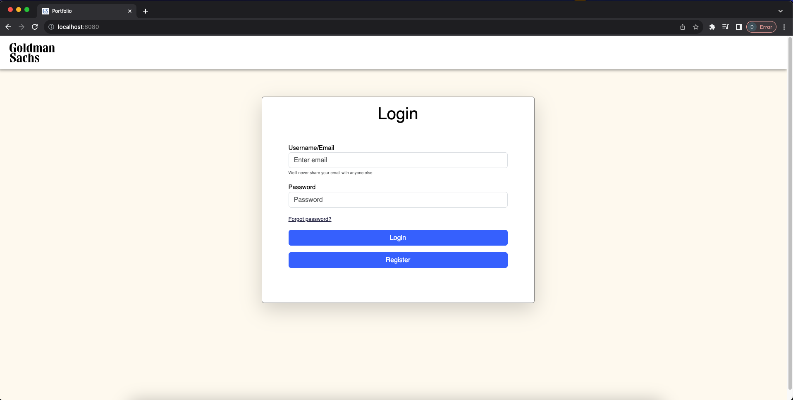
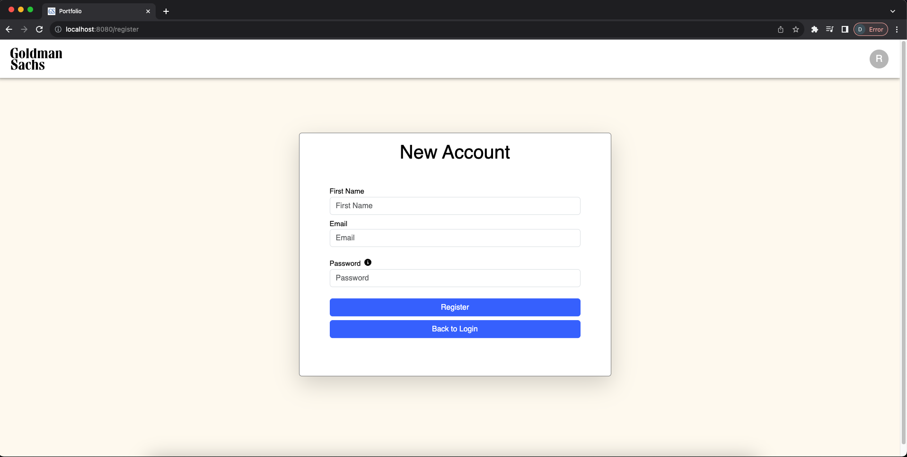
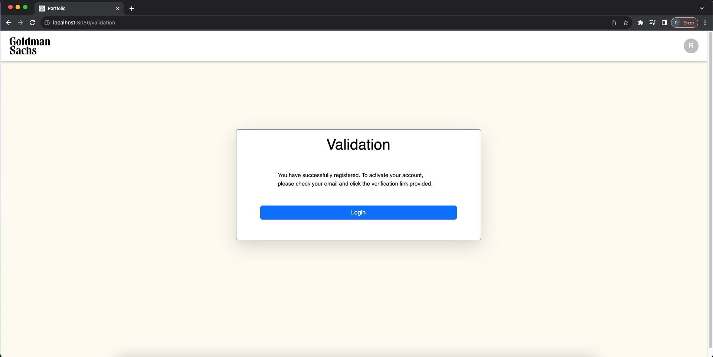
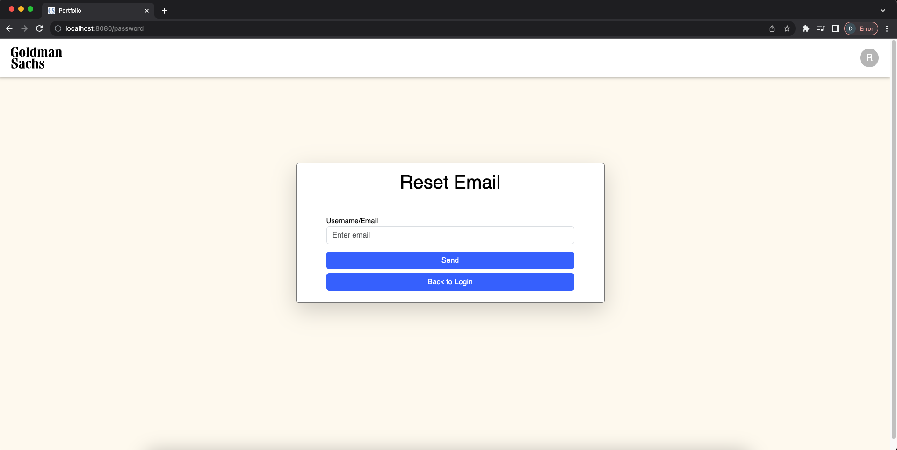
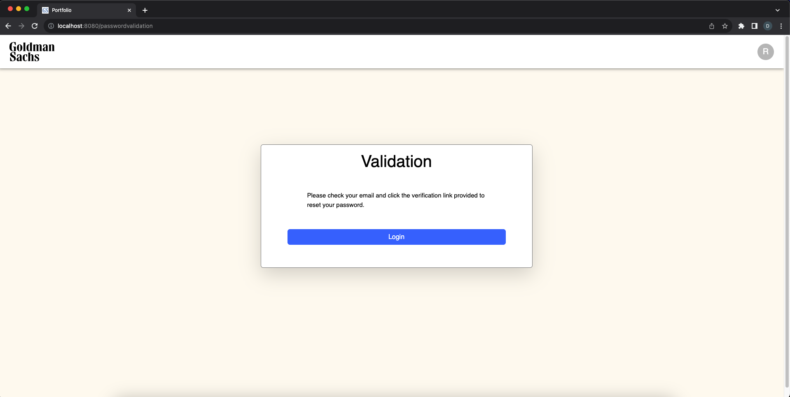
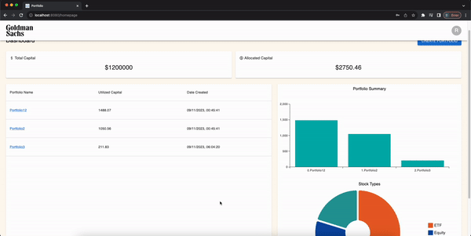
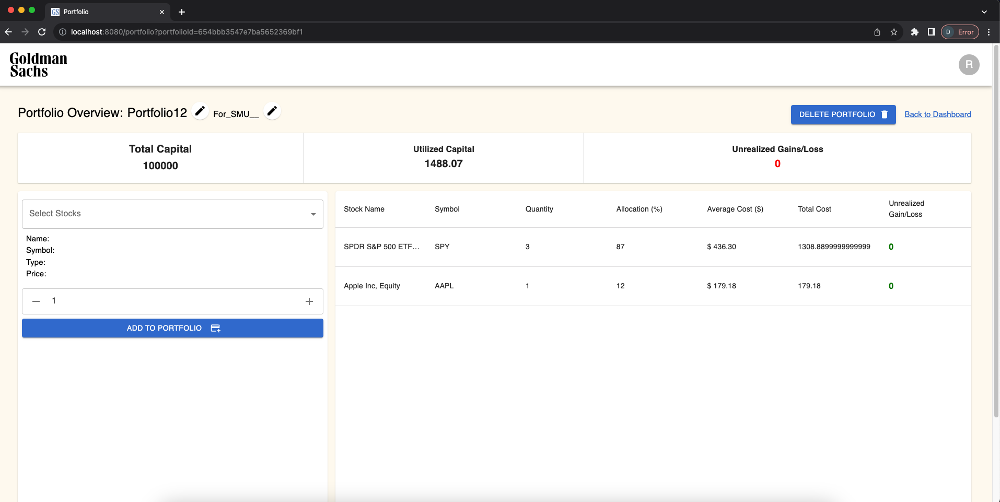
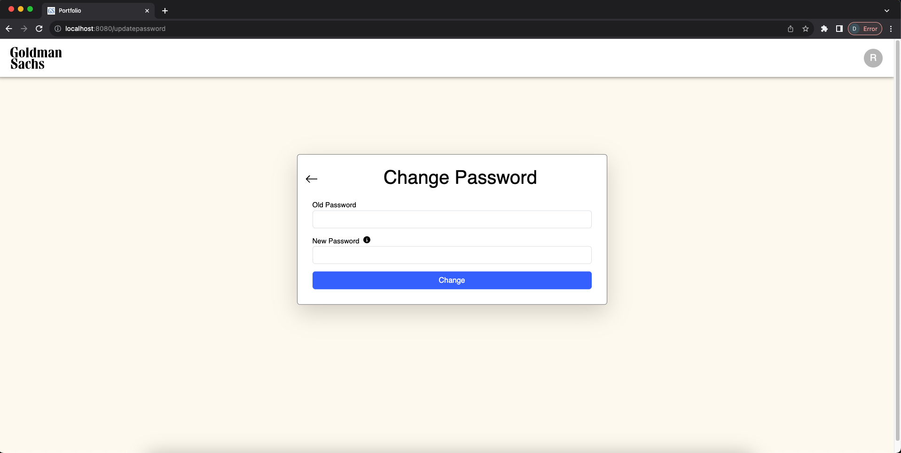

# Foliowatch

## Contributors
* Bella Leo
* Darrell Ng
* Darien Tan
* Eugene Toh
* Ivan Lim
* Jules Robins

## Project Overview
The Goldman Sachs Group, Inc. is a prominent global financial institution, offering a wide array of financial services to a diverse clientele, including corporations, financial institutions, governments, and individuals.

In light of this, we have been entrusted with the task of creating a robust system for investment advisors and finance professionals. This system's primary objective is to facilitate the analysis of investment portfolio performance and, in turn, empower users to make well-informed investment decisions.

The software will be equipped to gather, process, and present data in an intuitive and user-friendly manner. Users will have the capability to compare and assess different portfolios using essential metrics and performance indicators.

## Libraries Used
1. Java
2. Maven
3. Spring Boot
4. MongoDB
5. Redis
6. React

## Onboarding

### Installation

- Obtain the latest `.env` file and ensure that it is situated in the root directory of this repo.

### Running in production

- Build the Docker Compose image:

```bash
docker compose build
docker compose up -d
```

### Running in development

- Run the following command:

```bash
./mvnw spring-boot:run
```

### Developing Foliowatch

1. Open two terminals in your IDE. One of them will be used for developing the frontend and the other the backend.
2. For the frontend, navigate to the `frontend` folder (`cd frontend`) and run `npm run install`, then `npm run watch` to export the built files to Spring Boot.
3. For the backend, run `./mvnw spring-boot:run`. The website will be running in port 8080 by default. The application will be rebuilt if any Java source files are modified automatically. For the frontend, you will have to reload the page in your browser to realise any changes.
4. To get the Swagger OpenAPI documentation, navigate to `/api/docs/ui`.
5. To generate API fetching code for the frontend after adding new endpoints, run `npm run generate` in the `frontend` folder while the backend server is still running.

## Swagger
Documentation of an interactive, machine and human-readable API documentation.
`/api/docs/ui`


## Use Case Diagram


## Architecture Diagram


## Context Diagram


## Container Diagram


## ER Diagram


🤓 How to Use Our Web Application
Upon visiting our website, the user will be brought to the login page. If the user is a new visitor, he can sign up for an account with us by clicking on the 'Register' button. If the user already has an account, he can simply key his credentials and click on the 'LOGIN' button. In additon, if the user forgets his password, he/she may click the "Forgot password"


At the sign up page, the user is required to fill in their email, first name and password!


If any of the fields does not satisfy the criteria, an error will be displayed.


After the account registration, it will then send an email to the user for validation.


Proceed to click on the link sent to your email.

The user will then be brought back to the login page and now he/she will be able to login using his/her credentials.

If the user forgets his/her password, he will be required to enter his/her email.


After clicking the "Send" button, it will then send an email to the user for validation.


Proceed to click on the link sent to your email.


The user will then be brought to reset his/her password.

Upon pressing the "Submit button" the user can now login using his/her new password.

Upon logging in, the webpage will display a dashboard which shows the portfolios that were created by the user, a summary of portfolios and stock types.


The user can create a new portfolio be selecting the "Create portfolio" button.


The user can view each individual portfolio and it will display the stock name, symbol, quantity, allocation, average cost, total cost and unrealized gain/loss. In addition, the user may add more stocks, edit the portfolio name and strategy.


The user may edit his account by clicking on the top right icon.


The user may also change his password.
